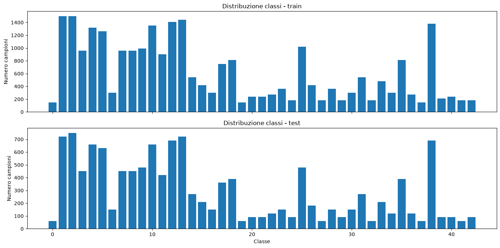
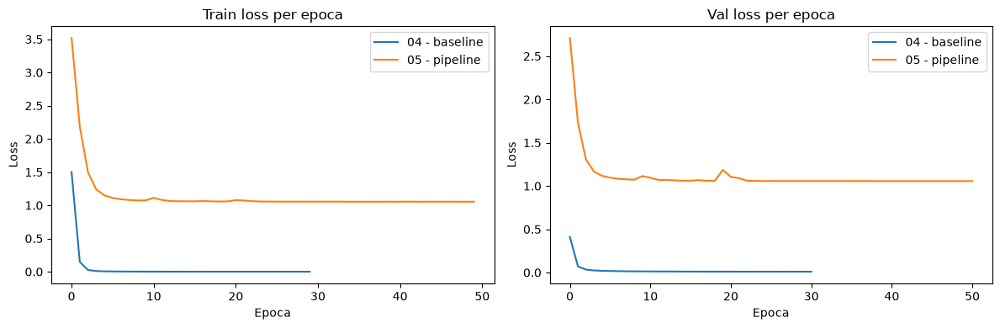

# Esercizio 2 — Classificazione GTSRB

Obiettivo: classificare 43 classi di segnali stradali (dataset GTSRB), da una baseline con feature preaddestrate fino a una pipeline di fine-tuning consolidata.

## Notebook

**01_eda_gtsrb** — EDA. 26.640 immagini train / 12.630 test. 43 classi, da 150 a 1.500 campioni ciascuna (rapporto 10:1). Risoluzione media ~50×50px (25×25 min, oltre 230px alcuni outlier), aspect ratio medio 1.0 (std 0.07–0.08). Distribuzione coerente tra train e test. Trasformazione scelta: resize a 68px + crop a 64px, `CenterCrop` in validation/test per determinismo.

**02_preprocessing** — Verifica dei DataLoader (`src.dataset.get_dataloaders`), batch size 128, 8 worker. 167 batch/epoca in train, 99 in test. Shape batch confermate: `[128, 3, 64, 64]`.

**03_baseline_features_svm** — ResNet18 pretrained (ImageNet) congelata come feature extractor, output 512-d. Gli input usano le statistiche di normalizzazione ImageNet coerenti con i pesi preaddestrati. Classificatore: `SVC(kernel="linear")`; nessun fine-tuning della rete.

**04_finetuning_baseline** — Fine-tuning end-to-end di ResNet18 (11.2M parametri). AdamW, lr 1e-4, 30 epoche massime, batch 512, 8 worker, nessuna augmentation (`strategy="none"`), nessun peso di classe, label smoothing disattivato, nessun scheduler e nessun early stopping. Validation e test sono calcolati sul checkpoint con F1 macro di validation migliore. Logging: `CSVLogger` locale.

**05_pipeline_experiments** — Stesso backbone (ResNet18) e ottimizzatore (AdamW) di `04`, configurati via `config.yaml`: lr 1e-4, 50 epoche massime, batch 512, 8 worker. Aggiunte rispetto a `04`: pesi di classe nella loss, augmentation `heavy_blur` (rotazione, color jitter, blur gaussiano condizionale), label smoothing 0.1, scheduler `OneCycleLR`, early stopping su `val/loss` (patience 5). Logging: `WandbLogger` + `CSVLogger` in parallelo.

## Risultati

| Notebook | Metodo | Val Accuracy | Val F1 macro | Test Accuracy | Test F1 macro |
|---|---|---|---|---|---|
| 03 | ResNet18 freeze + SVM | — | — | 0.62 | 0.5311 |
| 04 | Fine-tuning baseline | 0.9977 | 0.9978 | 0.9347 | 0.8906 |
| 05 | Pipeline finale | 1.0000 | 1.0000 | 0.9856 | 0.9778 |

Delta `05` vs `04` sul test set: +0.0509 accuracy, +0.0872 F1 macro.

