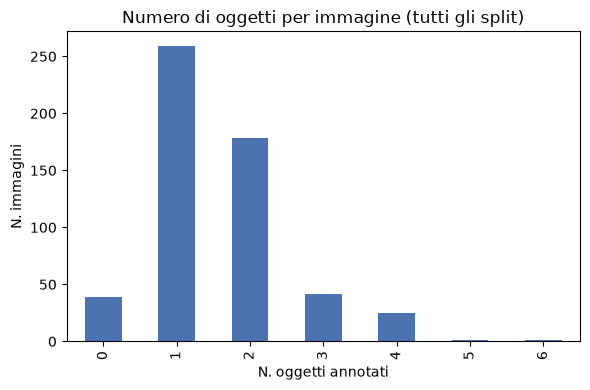
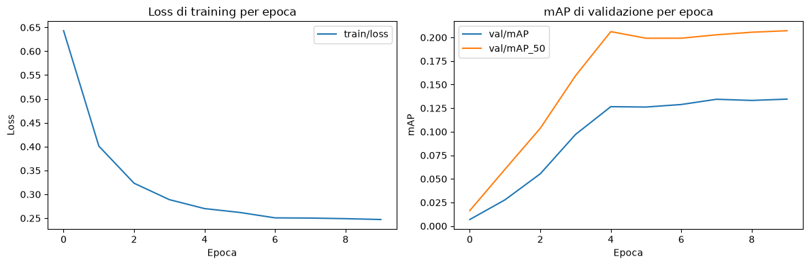
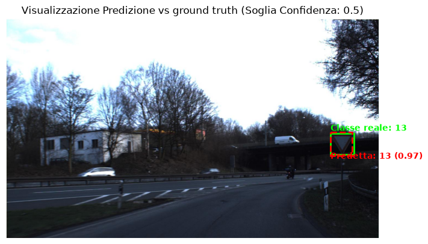

# Esercizio 3.3 - Object Detection GTSRB (Faster R-CNN)

L'esercizio estende la classificazione di singoli segnali alla detection in immagini stradali complete. Una ResNet-50 viene prima fine-tunata su GTSRB e successivamente impiegata come backbone di Faster R-CNN.

## Notebook

**01_eda_detection_dataset** - Analisi esplorativa del dataset `keremberke/german-traffic-sign-detection`, delle classi e delle bounding box.

**02_resnet50_pretraining** - Fine-tuning di ResNet-50 sulla classificazione GTSRB. Il checkpoint con F1 macro di validazione migliore viene riutilizzato dal detector.

**03_object_detection_dataset** - Controllo del `LitGTSRBDetectionDataModule`, della struttura dei target e visualizzazione delle bounding box reali.

**04_faster_rcnn_training** - Costruzione di un backbone ResNet-50 FPN a partire dal checkpoint GTSRB. La FPN, la Region Proposal Network e le teste compatibili mantengono l'inizializzazione COCO; il box predictor viene adattato alle 43 classi GTSRB piu' il background. Il miglior checkpoint viene selezionato tramite mAP_50 e ricaricato per verificarne la riproducibilita'.

**05_evaluation_and_inference** - Calcolo di mAP, mAP_50 e mAP_75 sul validation set e confronto visivo tra bounding box reali e predette.

## Configurazione

- batch size: 4;
- ottimizzatore: SGD, learning rate 0,005;
- durata: 10 epoche;
- precisione mista a 16 bit;
- risoluzione interna: 800-1360 px;
- normalizzazione coerente con il fine-tuning GTSRB;
- validazione eseguita esclusivamente in modalita' di inferenza.

## Risultati

| Fase | Metrica | Valore |
|---|---|---:|
| Training | Migliore val mAP_50 registrata | 0,207 |
| Checkpoint ricaricato | mAP | 0,1374 |
| Checkpoint ricaricato | mAP_50 | 0,2105 |
| Checkpoint ricaricato | mAP_75 | 0,1499 |

Il checkpoint ricaricato riproduce i risultati ottenuti durante il training. La lieve differenza rispetto alla mAP_50 registrata nel CSV dipende dalla precisione numerica: mixed precision durante il fit e 32 bit nella valutazione finale. La maggior parte del miglioramento si concentra nelle prime cinque epoche; successivamente le metriche entrano in plateau. La differenza tra mAP_50 e mAP_75 evidenzia che la localizzazione precisa dei segnali, spesso molto piccoli rispetto al fotogramma, rimane il principale elemento di difficolta'.

L'esempio seguente mostra una detection corretta della classe 13 con confidenza 0,97 e una buona sovrapposizione tra bounding box reale e predetta.

