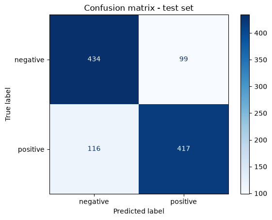

# Esercizio 1 — Baseline con feature DistilBERT congelate

Obiettivo: sentiment analysis su Rotten Tomatoes usando DistilBERT come estrattore fisso di feature, come riferimento per il fine-tuning dell'Esercizio 2.

## Notebook

**01_eda_dataset_and_tokenizer** — EDA. Split ufficiali: 8530 train / 1066 validation / 1066 test, perfettamente bilanciati (4265/533/533 per classe). Lunghezza testi: mediana ~20-21 parole, 99° percentile ~45-46 → giustifica `max_length=128`. Tokenizer WordPiece; vettore `[CLS]` dell'ultimo layer a 768 dimensioni.

**02_feature_extraction_baseline** — DistilBERT congelato (nessun aggiornamento pesi) + `LinearSVC` sui vettori `[CLS]`. Feature: `(8530, 768)` train, `(1066, 768)` validation/test.

## Risultati

| Split | Accuracy | F1 macro |
|---|---|---|
| Validation | 0,8218 | 0,8217 |
| Test | 0,7983 | 0,7983 |

