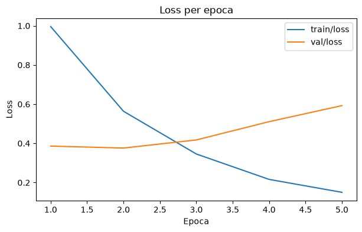

# Esercizio 2 — Fine-tuning DistilBERT

Obiettivo: fine-tuning end-to-end di `distilbert/distilbert-base-uncased` su Rotten Tomatoes, a confronto con la baseline a feature congelate dell'Esercizio 1.

## Notebook

**01_distilbert_finetuning** — `Trainer` di Hugging Face: tokenizzazione con `Dataset.map`, `AutoModelForSequenceClassification`, `DataCollatorWithPadding` per il padding dinamico, `TrainingArguments` con `load_best_model_at_end=True` e `metric_for_best_model="f1_macro"`. 5 epoche, batch 16 (accumulo gradiente 2), lr 2e-5, training completato in circa 81 secondi su `cuda`.

## Risultati

| Split | Accuracy | F1 macro |
|---|---|---|
| Validation (epoca 5, checkpoint migliore) | 0,8490 | 0,8490 |
| Test | 0,8424 | 0,8424 |

Guadagno sul test set rispetto alla baseline dell'Esercizio 1 (0,7983/0,7983): circa `+0,044` sia in accuracy sia in F1 macro.

La validation loss tocca il minimo all'epoca 2 (0,376) e risale a 0,593 all'epoca 5, mentre la training loss scende da 0,996 a 0,150: l'epoca 5 ha F1 macro più alto ma anche loss più alta dell'epoca 2, quindi la selezione del checkpoint su F1 macro o su `eval_loss` porterebbe a scegliere epoche diverse.

