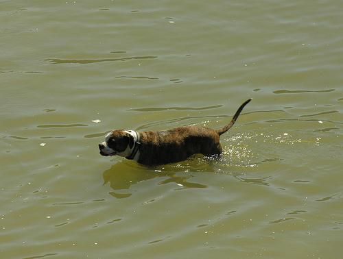

# Esercizio 3.3 — CLIP Text-to-image Retrieval

Obiettivo: sistema di retrieval text-to-image su Flickr8k con interfaccia Gradio.

## Notebook

**01_flickr8k_eda** — EDA su `jxie/flickr8k`. Split `train` con 6000 righe, colonna immagine `image`, colonna caption `caption_0`, nessuna colonna id. Subset indicizzato: 1000 immagini, seed 42, caption con media 12,3 parole (min 4, max 32).

**02_clip_retrieval_demo** — Costruzione dell'indice CLIP (`openai/clip-vit-base-patch32`) sullo stesso subset, verifica del ranking su query testuali. Similarità: prodotto scalare tra embedding normalizzati (cosine similarity).

**app.py** — Applicazione Gradio standalone che usa lo stesso modulo `src.clip_retrieval` del notebook di verifica.

## Risultati

Query di controllo `a dog running through water`: primo risultato con score 0,340, caption `A brown and white dog , wearing a collar , is moving through some water .`.

| Query | Score top-1 |
|---|---|
| a dog running through water | 0,340 |
| a child in a red shirt | 0,298 |
| people playing football on a field | 0,303 |

Il sistema funziona bene su prompt visivi diretti (es. "dog running through water"); è meno preciso su query con vincoli multipli (es. colore dell'abbigliamento) o scene relazionali complesse (es. "football"), atteso per un setup zero-shot senza fine-tuning.

