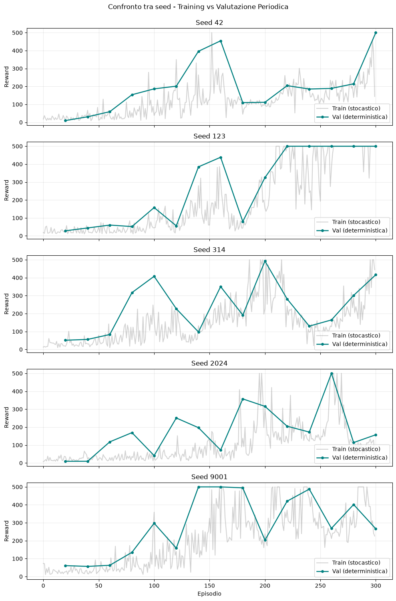

# Esercizio 1 — REINFORCE su CartPole

Il notebook `01_reinforce_cartpole.ipynb` costruisce una baseline REINFORCE
modulare su `CartPole-v1` e introduce una valutazione più affidabile del solo
reward mobile di training.

## Pipeline

1. ispezione dello spazio continuo delle osservazioni e delle due azioni;
2. verifica del calcolo dei ritorni scontati;
3. addestramento indipendente su cinque seed;
4. valutazione deterministica ogni 20 episodi, su 10 episodi;
5. ripristino del checkpoint con reward medio periodico migliore;
6. valutazione finale e rendering della policy selezionata.

Il codice è separato nei moduli `src/networks.py`, `src/reinforce.py`,
`src/evaluation.py`, `src/plotting.py` e `src/utils.py`. I parametri
dell'esperimento sono raccolti in `config.yaml`.

## Risultati

Quattro seed ottengono reward medio finale `500.0`; il seed 2024 raggiunge
`493.0`. La media sui cinque seed è quindi `498.6 ± 3.1`. In CartPole il reward
cresce di uno a ogni step, perciò reward medio e lunghezza media coincidono.

Il divario tra alcuni reward finali di training e la valutazione deterministica
è atteso: durante il training le azioni sono campionate dalla policy stocastica,
mentre la valutazione usa sempre l'azione più probabile. La metrica conclusiva è
quindi la valutazione del miglior checkpoint, non l'ultimo episodio di training.

