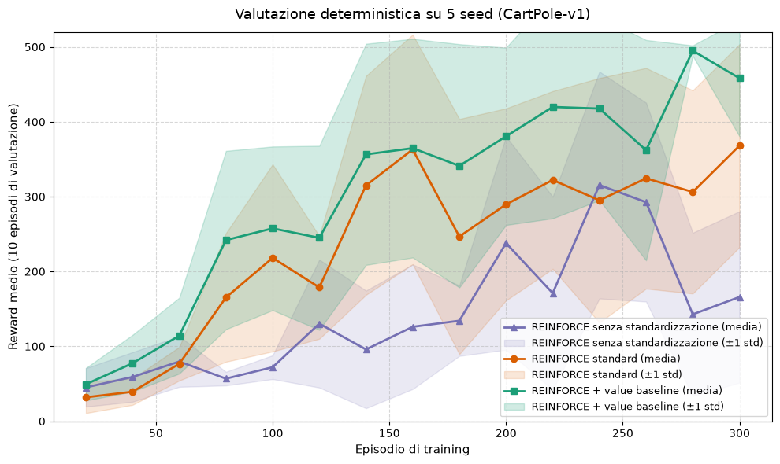

# Esercizio 2 — REINFORCE con baseline di valore

Il notebook `01_reinforce_value_baseline.ipynb` confronta su `CartPole-v1` tre
varianti controllate dello stesso algoritmo:

1. ritorni scontati non standardizzati;
2. ritorni standardizzati all'interno dell'episodio;
3. advantage appresa `G_t - V(s_t)`, con una seconda rete neurale per il valore.

## Metodo

Le tre varianti condividono architettura, budget di 300 episodi, learning rate,
cinque seed e protocollo di valutazione. Ogni 20 episodi vengono eseguiti 10
episodi deterministici; per la valutazione finale viene ripristinato il miglior
checkpoint di ciascuna run. In questo modo il confronto isola l'effetto della
standardizzazione e quello della baseline dipendente dallo stato.

La policy loss della terza variante usa l'advantage con `V(s)` scollegata dal
gradiente della policy. La value network è addestrata separatamente tramite MSE
tra valore previsto e ritorno scontato.

## Risultati

| Variante | Reward medio | Deviazione standard | Minimo globale |
|---|---:|---:|---:|
| Senza standardizzazione | 401.2 | 106.1 | 171.0 |
| Ritorni standardizzati | 498.6 | 3.1 | 430.0 |
| Value baseline | 499.9 | 0.1 | 497.0 |

La standardizzazione produce il miglioramento principale in stabilità. La rete
di valore aggiunge un incremento più piccolo ma rende il risultato quasi
costante tra i cinque seed.

