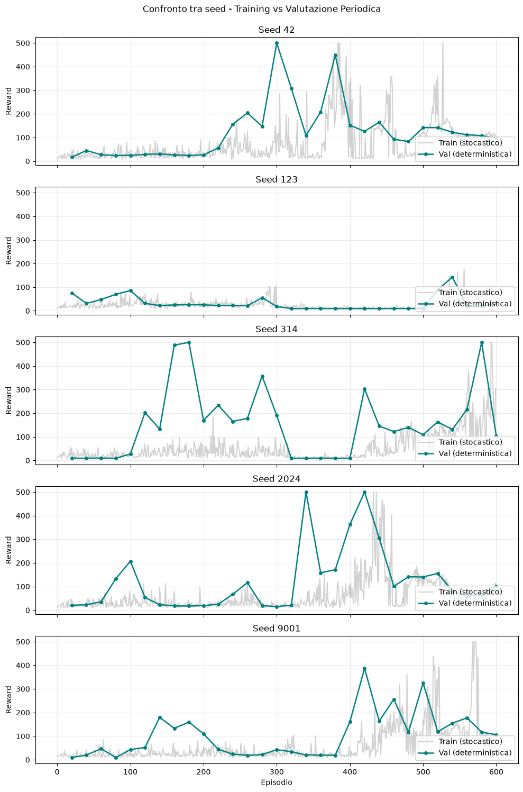
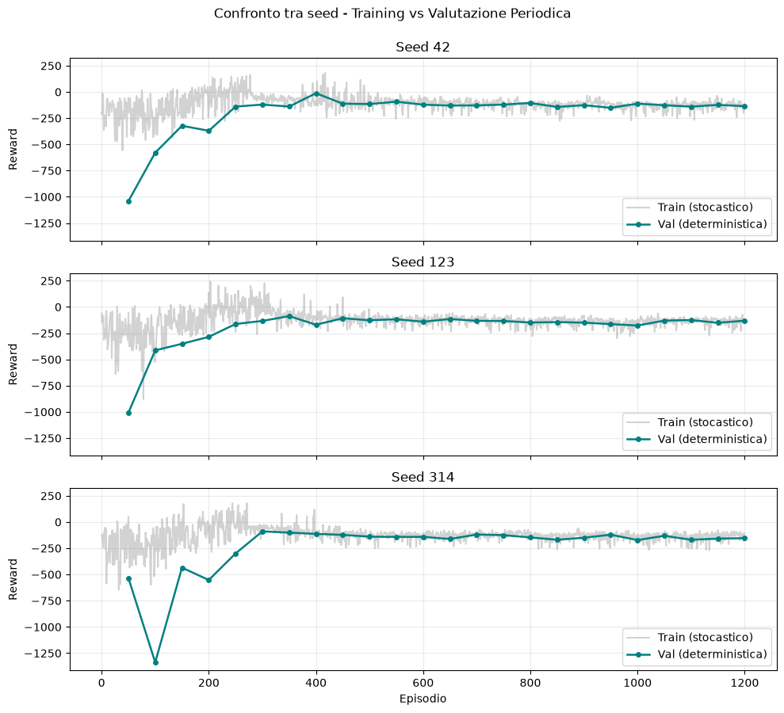

# Esercizio 3.1 — A2C su CartPole e LunarLander

Questa cartella implementa Advantage Actor-Critic con rollout n-step e bootstrap
del critic. Actor e critic sono MLP distinte, ottimizzate con una loss congiunta
formata da policy loss, value loss e bonus di entropia.

## Notebook

1. `01_a2c_cartpole.ipynb`: validazione su CartPole con cinque seed;
2. `02_a2c_lunarlander.ipynb`: applicazione a LunarLander con tre seed;
3. `03_a2c_lunarlander_hyperparameter_search.ipynb`: ricerca Optuna aggiuntiva e
   conferma multi-seed della configurazione candidata.

Le configurazioni correnti usano `SyncVectorEnv` con otto ambienti sia su
CartPole sia su LunarLander. Gli advantage dell'actor sono standardizzati. Su
LunarLander viene inoltre riscalata la loss del critic tramite una stima mobile
della varianza dei target, senza centrare o modificare i ritorni bootstrap.

## Valutazione

Ogni seed usa un actor, un critic e ambienti indipendenti. La policy viene
valutata periodicamente in modo deterministico; actor e critic del checkpoint
migliore vengono conservati insieme e ripristinati prima della valutazione
finale.

## Risultati

| Ambiente | Seed | Reward medio | Deviazione standard | Intervallo tra seed |
|---|---:|---:|---:|---:|
| CartPole | 5 | 402.2 | 156.0 | 142.4–500.0 |
| LunarLander | 3 | -70.4 | 53.6 | -109.1–-9.3 |

Su CartPole tre seed raggiungono `500.0`, mentre due run restano molto più
deboli: l'implementazione è valida ma sensibile al seed. Su LunarLander la
baseline A2C produce occasionalmente episodi positivi, ma il reward medio rimane
negativo per tutti i seed e l'ambiente non può essere considerato risolto.

La ricerca Optuna trova una configurazione con una run di conferma positiva
(`124.4` per il seed 123), ma le altre due restano negative (`-68.6` e `-77.2`).
Il risultato è quindi promettente ma ancora instabile e non sostituisce la
baseline come soluzione consolidata.

