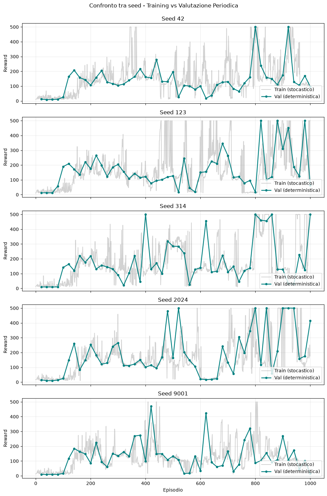
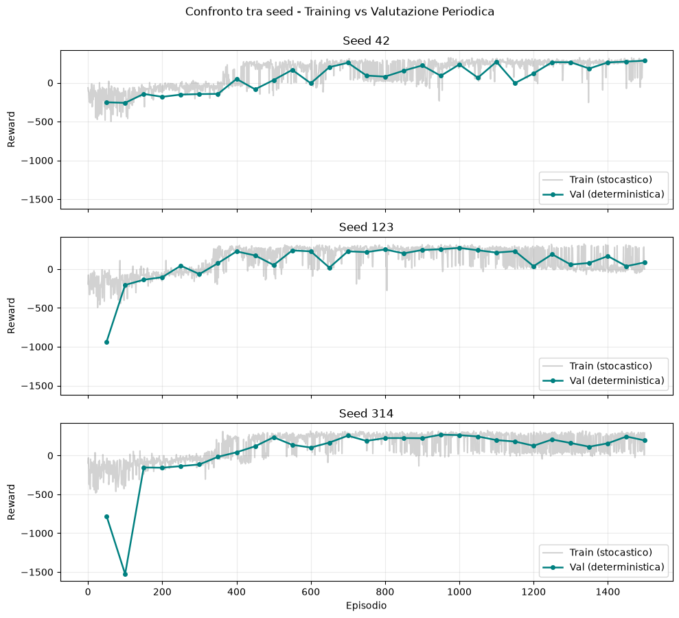

# Esercizio 3.2 — Deep Q-Learning su CartPole e LunarLander

La pipeline implementa DQN per stati continui e azioni discrete, includendo i
due meccanismi di stabilizzazione fondamentali: replay buffer e target network.

## Componenti

- `QNetwork`: MLP che stima `Q(s, a)` per ogni azione;
- `ReplayBuffer`: archivio FIFO con campionamento casuale dei minibatch;
- target TD costruito con una copia periodicamente aggiornata della Q-network;
- policy epsilon-greedy con decadimento lineare dell'esplorazione;
- Huber loss e clipping della norma del gradiente;
- raccolta vettorializzata tramite otto ambienti sincroni.

## Notebook

1. `01_dql_cartpole.ipynb`: training e valutazione su cinque seed;
2. `02_dql_lunarlander.ipynb`: training e valutazione su tre seed.

Ogni notebook esegue valutazioni deterministiche periodiche, conserva il
checkpoint con reward medio migliore e lo valuta infine su un ambiente con seed
distinto da quello usato nella selezione.

## Risultati

| Ambiente | Seed | Reward medio | Deviazione standard | Minimo tra le medie |
|---|---:|---:|---:|---:|
| CartPole | 5 | 494.6 | 12.0 | 473.1 |
| LunarLander | 3 | 274.0 | 11.1 | 262.3 |

Su CartPole quattro seed raggiungono `500.0`; il quinto ottiene `473.1`. Su
LunarLander tutti i seed superano la soglia di reward 200, con medie comprese tra
`262.3` e `284.4`. Anche i rendering finali mostrano atterraggi positivi per la
policy selezionata.

L'implementazione rimane intenzionalmente essenziale: non include Double DQN,
Dueling DQN o replay prioritizzato. Questo mantiene visibile il contributo del
replay buffer, del bootstrap TD e della target network.

