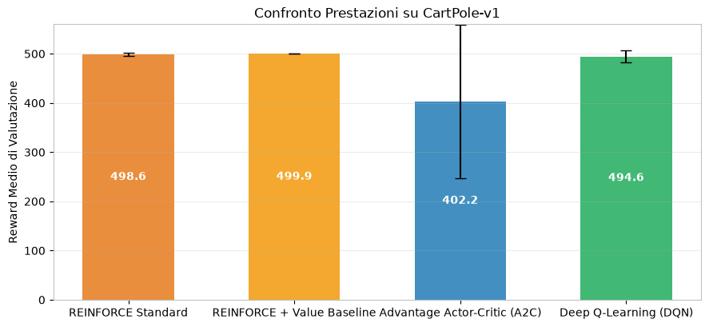
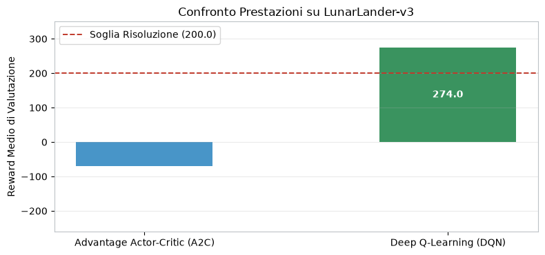

# Confronto tra gli algoritmi

Il notebook `01_algorithms_comparison.ipynb` sintetizza i risultati finali dei
notebook precedenti. Non esegue nuovi training: costruisce tabelle e grafici dai
valori già consolidati nelle valutazioni finali.

## CartPole

- REINFORCE senza standardizzazione è molto sensibile al seed;
- la standardizzazione dei ritorni porta la media da `401.2` a `498.6`;
- la value baseline riduce ulteriormente la dispersione (`499.9 ± 0.1`);
- A2C raggiunge il massimo in tre seed ma è il metodo più variabile;
- DQN è stabile, con reward medio `494.6 ± 12.0`.

## LunarLander

A2C ottiene reward medio `-70.4 ± 53.6` e non risolve stabilmente l'ambiente.
DQN raggiunge invece `274.0 ± 11.1`, superando la soglia di reward 200 in tutti
i seed. In questa configurazione, il metodo off-policy con replay buffer riusa
le transizioni in modo più efficace e risulta nettamente più stabile.

Il confronto va letto tenendo conto dei diversi budget di training e delle
diverse dinamiche esplorative: descrive gli esperimenti effettuati, non una
classifica universale degli algoritmi.
